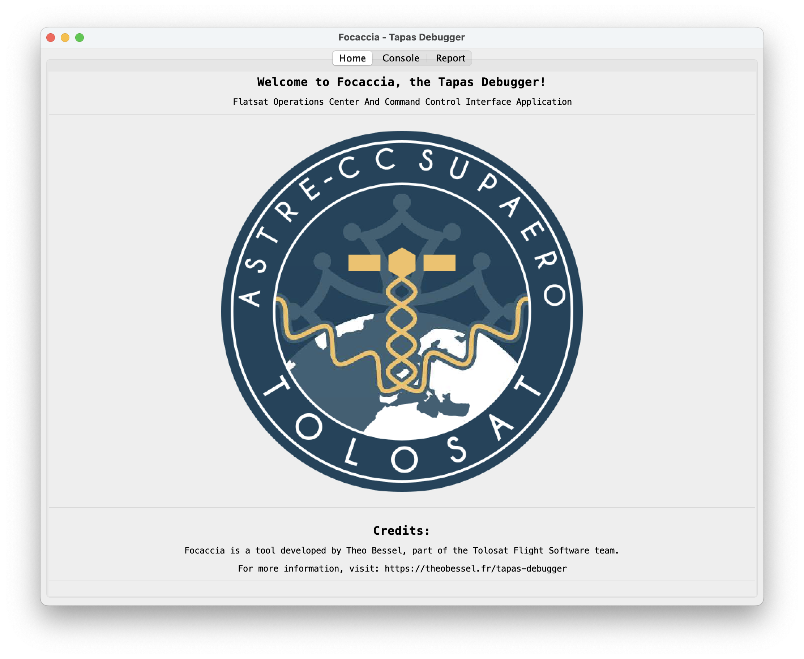
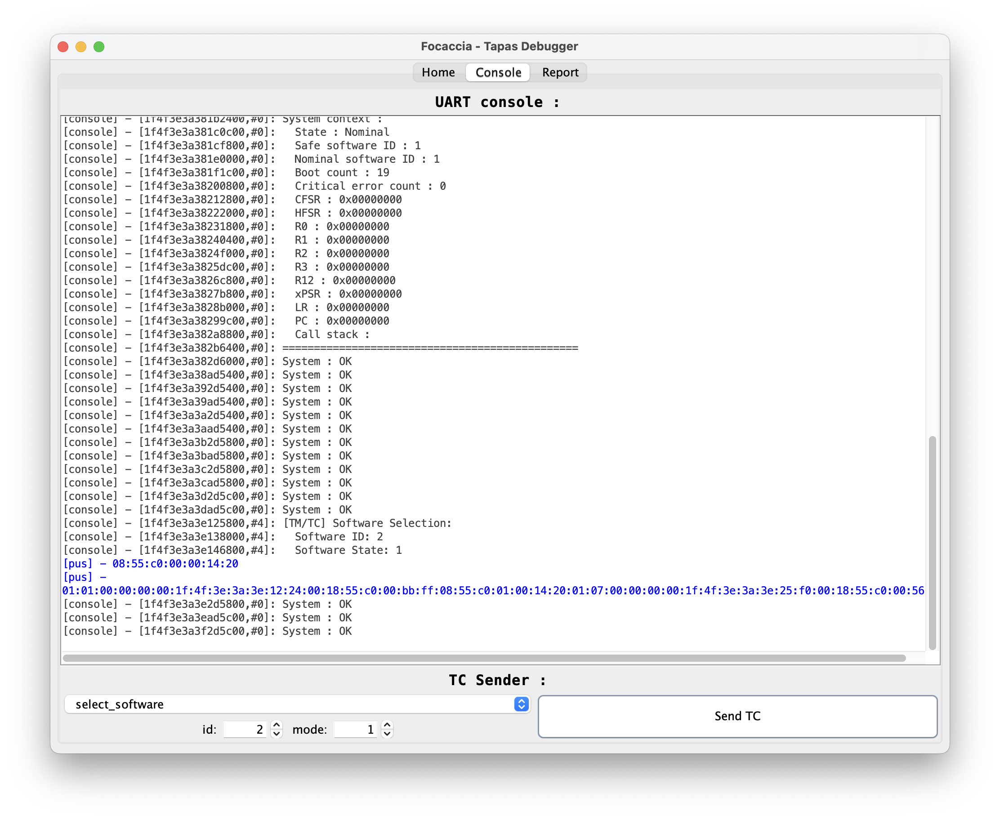
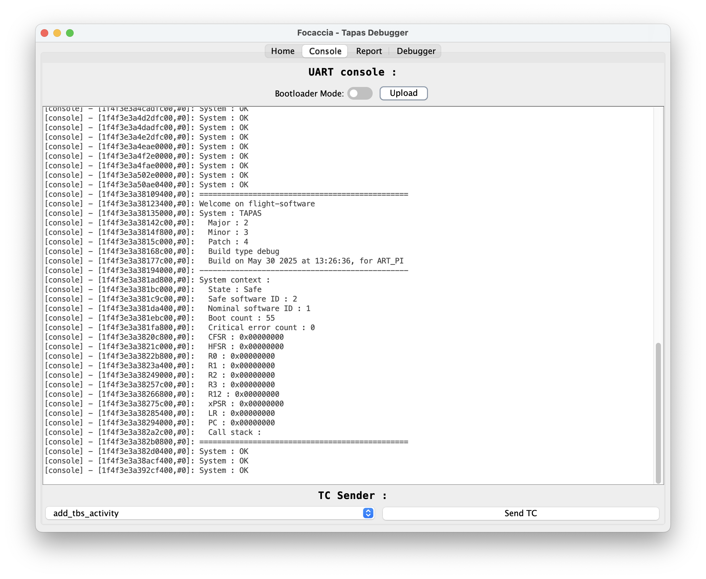

# FOCACCIA
**F**latsat **O**perations **C**enter **A**nd **C**ommand **C**ontrol **I**nterface **A**pplication

---

### Introduction

This project is a part of **TOLOSAT flight software**, which I am currently developing. The idea of this debug interface came after I implemented the advanced reboot for the satelitte and the associated "system" **PUS** service, I needed a tool to monitor in real time what was happening in the flight software.

### Installation

You can build the software for your computer very easily, all you need is an up to date java version (I used java 21 on my computer), and make.

Then you can clone this repository, and run `make run` in the repository directory.

The software should start after a few seconds and let you debug your favorite chip.

### Configuration

You can configure the software to use your own hardware by using the files located in the `config/` folder. For the moment all you need to do is to set-up the serial port names.

I will soon start to work on a configuration interface for that.

In the future I will also work on a way to configure the list of available **TC**s in json configuration files.

### Features

**FOCACCIA** allows you to monitor at the same time the console through an **UART** connection and to send **TC**s/recieve **TM**s through the **UART** over **USB** connection (contained in the **USB**-debug port of the [**ART-PI**](https://github.com/RT-Thread-Studio/sdk-bsp-stm32h750-realthread-artpi?tab=readme-ov-file) development board used to develop **TOLOSAT** flight software).

It also allows you to send **TC**s to the satelitte and to monitor the **TM**s sent by the satelitte in real time.

It is also possible to view the satelitte's console in real time.

The software will soon be able to parse the **PUS** **TC**s and **TM**s, and to display them in a human readable way. It also allows you to send **TC**s by clicking on the buttons in the interface.

It is also able to flash the satelitte's software from the interface, this allows to update the flight software directly from the interface without having to use the command line tools. It also permits to write the option bytes and then to switch between the booloader mode and the application mode.

### Technical choices

Since the **TM**/**TC**s are recieved through **UART** and the console can work in **UART** mode too I needed to manage these two connextions in order to have a clean monitoring of the satelitte.

To address this problematic, I used the [jSerialComm](https://github.com/Fazecast/jSerialComm) **API**; this made the **UART** communication implementation way easier than if I had to implement all the backend by myself.

In term of architecture, this project used a global **MVC** ([Model View Controller](https://en.wikipedia.org/wiki/Model–view–controller)) design pattern.

The **TC** send interface uses a [Composite](https://en.wikipedia.org/wiki/Composite_pattern) design pattern to build the **UI** from small bricks directly mapping the datatypes contained in the **TC**s and an [Observer](https://en.wikipedia.org/wiki/Observer_pattern) to update the data from the **UI** in real time.

### Acronyms

**PUS**: Packet Utilization Standard

**TC**: Telecommand

**TM**: Telemetry

**UART**: Universal Asynchronous Receiver-Transmitter

**USB**: Universal Serial Bus

**MVC**: Model View Controller

**API**: Application Programming Interface